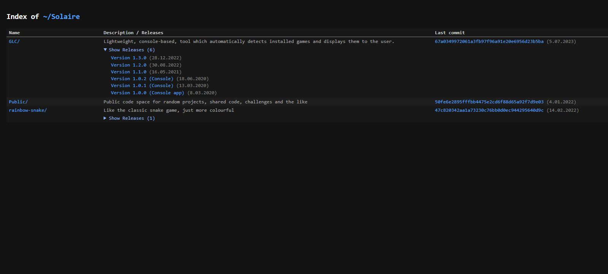

# ~/Solaire – GitHub Repo Index

This project is a minimalist, XAMPP-style directory listing of all public repositories belonging on my [GitHub](https://github.com/solaire) account.

## Features

- Lists all **public repositories** (excluding special-purpose ones like `solaire` and `solaire.github.io`)
- Shows:
  - Repository name (linked)
  - Description
  - GitHub Releases (collapsible list)
  - Last commit:
    - Short SHA (linked)
    - Commit date

## Styling

- Inspired by classic **XAMPP/Apache-style** directory listings
- Fully **dark mode** themed with monospace fonts

## GitHub API

This project uses the public [GitHub REST API v3](https://docs.github.com/en/rest) for:
- Repository listing
- Release listing
- Commit info

No authentication is used, but unauthenticated requests are rate-limited to ~60 requests/hour.

## License

MIT — feel free to use, modify, and share.
